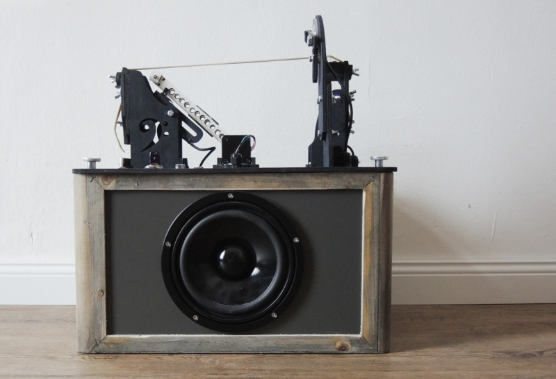

# BeatBassBox
A rubber band bass that plays sheet music based on MuseScore files.

Convert it with MSCX2BBB into a BBB file:

`java -jar MSCX2BBB.jar BeatBassBoxDemo.mscx` 

Result is a BBB file:

`BBB:1  
TITLE:BeatBassBoxDemo  
START  
  0: TP:060  
  1: BB:12:39 :           
  2: BB:12:37 :            
  3: BB:12:35 :              
  4: BB:24:34 :            
  5: BB:36:37 :            
  6: BB:24:33 :            
  7: BB:24:34 :            
  8: BB:48:35 :            
  9: < :008:002  
 10: TP:080  
 11: BB:18:39 :            
 12: BB:06:46 :   
 ...  `

