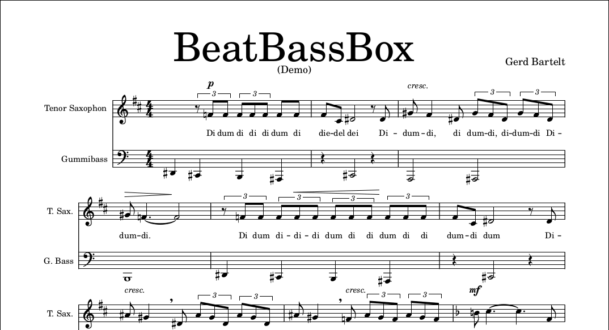

# BeatBassBox
A rubber band bass that plays sheet music based on MuseScore files.

Convert it with MSCX2BBB into a BBB file:

`java -jar MSCX2BBB.jar BeatBassBoxDemo.mscx` 

Result is a BBB file.

##Video:

##Project website:
[https://www.sebulli.com/bbb/index.php](https://www.sebulli.com/bbb/index.php)
